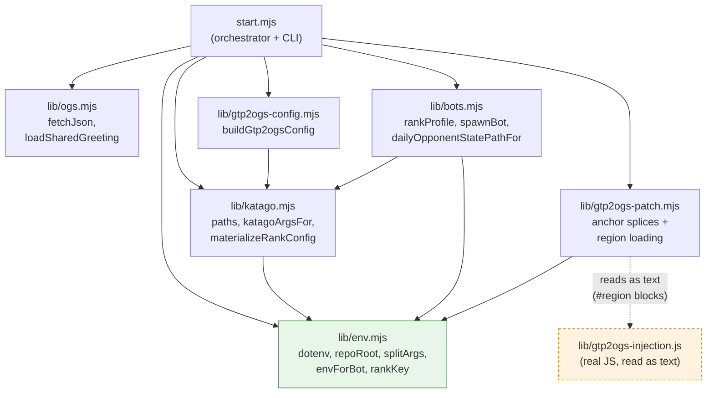
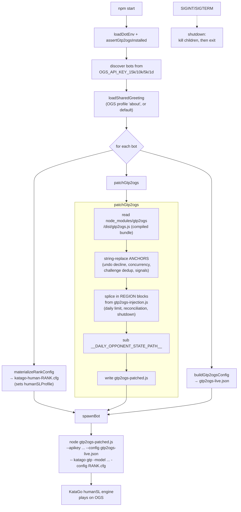

# kata-humanlike-ogs

Run KataGo humanSL bots on OGS through [`online-go/gtp2ogs`](https://github.com/online-go/gtp2ogs).

This repo is intentionally small: `gtp2ogs` handles OGS, and KataGo handles GTP move generation using the human SL model.

## How It Works

`scripts/start.mjs` is a thin orchestrator; the logic lives in `scripts/lib/`.



At startup the launcher builds, for each configured bot, a rank-specific KataGo config, a patched copy of the `gtp2ogs` bundle, and a `gtp2ogs` JSON config, then spawns one `gtp2ogs` child per bot.



Because `gtp2ogs` ships only a compiled webpack bundle, behavior changes (declining undos, one-game-at-a-time, one game per opponent per UTC day, REST challenge reconciliation, graceful shutdown) are applied by patching a copy of that bundle at startup. The patch has two parts: **anchors** are exact-match strings located in the compiled output (they must stay strings), while the larger injected methods are authored as real JavaScript in `scripts/lib/gtp2ogs-injection.js` between `// #region` markers and spliced in as text — so that code keeps syntax highlighting and parse checking.

## Setup

```bash
npm install
cp .env.example .env
```

Edit `.env` and set the shared KataGo paths:

- `KATAGO_MODEL`: regular/full KataGo model for `-model`.
- `KATAGO_HUMAN_MODEL`: human SL model, usually `b18c384nbt-humanv0.bin.gz`.

The checked-in defaults use the local paths found on this machine:

```text
/opt/homebrew/bin/katago
/Users/davidma/.katrain/kata1-b28c512nbt-s12704148736-d5790336910.bin.gz
/Users/davidma/.katrain/b18c384nbt-humanv0.bin.gz
```

## Smoke Test KataGo

Before connecting to OGS:

```bash
npm run smoke:gtp
```

This starts KataGo in GTP mode, plays one black move, asks it to generate white's move, and exits.

## Run on OGS

Set one API key per OGS bot account. The launcher starts every configured bot key it finds:

```text
OGS_API_KEY_15K=...
OGS_API_KEY_10K=...
OGS_API_KEY_5K=...
OGS_API_KEY_1D=...
```

`OGS_BOT_PLAYER_ID_5K` is optional. If set, the launcher reads the 5k bot profile's `about` text once and uses that as the in-game greeting for every bot.

```text
OGS_BOT_PLAYER_ID_5K=...
```

`OGS_REST_ACCESS_TOKEN` is optional but recommended. It enables a 30-second REST reconciliation loop for pending challenges, so a challenge missed by the websocket notification stream can still be accepted or declined. This must be an OAuth bearer token for the bot account with read/write access; the bot API key is still used for `gtp2ogs` itself, but OGS does not accept that key for the challenge-list REST endpoint.

```text
OGS_REST_ACCESS_TOKEN=...
```

Then run:

```bash
npm start
```

To validate generated configs without connecting to OGS:

```bash
node scripts/start.mjs --dry-run
```

This starts separate `gtp2ogs` sessions for each configured key among the `rank_15k`, `rank_10k`, `rank_5k`, and `rank_1d` bot profiles. They share the same KataGo binary, model paths, and base config, but each session gets its own generated config with the rank-specific `humanSLProfile` line. `gtp2ogs` expects a GTP engine per bot session, so the launcher shares the engine setup and model files rather than multiplexing one live GTP process.

Extra `gtp2ogs` arguments can be supplied in `.env`:

```bash
GTP2OGS_EXTRA_ARGS="--beta --debug"
```

The bot command launched by `scripts/start.mjs` is equivalent to:

```bash
gtp2ogs --apikey "$OGS_API_KEY_5K" -- \
  "$KATAGO_BIN" gtp \
  -model "$KATAGO_MODEL" \
  -human-model "$KATAGO_HUMAN_MODEL" \
  -config <generated rank-specific config>
```

## HumanSL Profile

The important generated KataGo config line is:

```text
humanSLProfile = rank_5k
```

The launcher generates configured `rank_15k`, `rank_10k`, `rank_5k`, and `rank_1d` variants from `config/katago-human-rank-5k.cfg`. This differs from KataGo's bundled `gtp_human5k_example.cfg`, which uses `preaz_5k`. The `rank_*` profiles match modern post-AlphaZero human openings, which is the same profile naming style used by `rankmle` when querying KataGo analysis with `overrideSettings.humanSLProfile`.

## OGS Bot Account Notes

`gtp2ogs` requires an OGS bot account and API key. Per the `gtp2ogs` README, create a separate bot account, ask an OGS moderator to flag it as a bot account, then generate the API key from the bot profile while logged in as the human operator.
